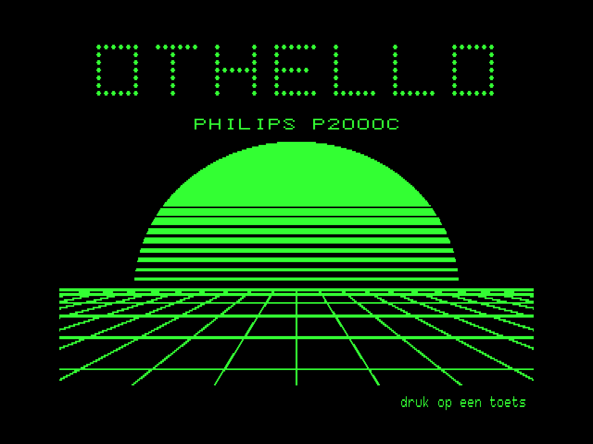
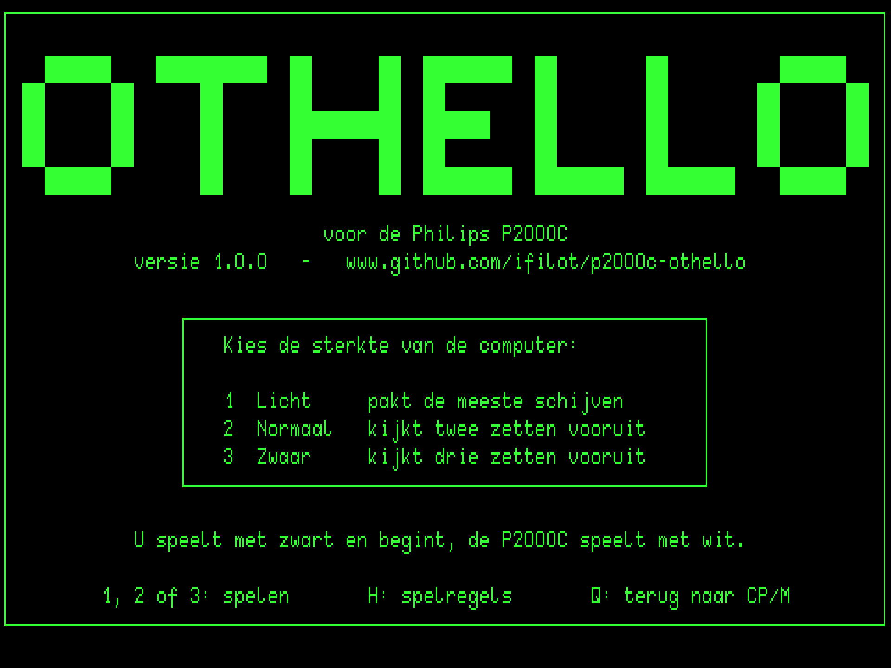
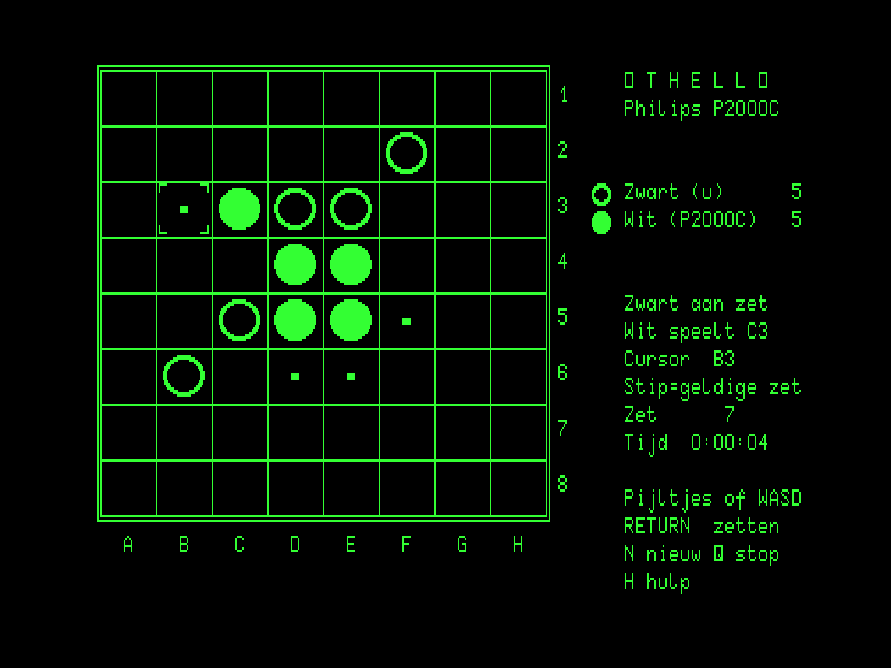

# Othello for the Philips P2000C

[](https://github.com/ifilot/p2000c-othello/actions/workflows/build.yml)
[](https://github.com/ifilot/p2000c-othello/releases)
[](LICENSE)

Othello (Reversi) against the computer, for the Philips P2000C running CP/M.
The game uses the terminal board's 512x252 high-resolution graphics mode for
the board and the text plane for the score panel. The user interface is in
Dutch. Three difficulty levels are offered at the start.

> [!NOTE]
> **More P2000C games:** Check out [Chess](https://github.com/ifilot/p2000c-chess),
> [Battleship](https://github.com/ifilot/p2000c-battleship),
> [Minesweeper](https://github.com/ifilot/p2000c-minesweeper), and
> [Tetris](https://github.com/ifilot/p2000c-tetris). For an all-in-one setup
> containing all five games, see the [P2000C ZuluBlaster SASI drive distribution](https://github.com/ifilot/p2000c-zulublaster-sasi-drive).

<p align="center">
  
  
</p>
<p align="center">
  
</p>

## Play

Download `OTHELLO.COM` from the [releases](https://github.com/ifilot/p2000c-othello/releases)
(or the latest [build artifact](https://github.com/ifilot/p2000c-othello/actions)),
copy it to a CP/M disk and run `OTHELLO`. With a ZuluBlaster/SASI setup,
`make deploy` produces `build/HD1_256.hda`, a second-disk image in the
standard split layout with the game on F:; copy it to the SD card in place
of the distribution's `HD1_256.hda` and run `F:OTHELLO`. The start screen (plain text, so it
appears instantly) asks for the difficulty; `1`, `2` or `3` starts the game.

| Key | Action |
| --- | --- |
| Cursor keys or `W` `A` `S` `D` | Move the cursor |
| `RETURN` or space | Place a disc |
| `H` | Help screen with the rules (plain text mode) |
| `D` (start screen) | Demo: the computer plays itself (level 2 against level 3); any key stops it |
| `N` | Back to the start screen for a new game |
| `Q` | Quit, after confirmation (immediate on the start screen) |

You play Black and move first; the P2000C plays White. After five minutes
without a keypress a screen saver blanks the picture (a quarter-bright
caption wandering over a black text screen, to spare the CRT); any key
brings the screen back. It never interrupts a running demo. Legal moves are marked
with a dot; the panel shows the move number and the elapsed time of the game. Levels: **1** plays the move that flips the most discs (corners
preferred), **2** and **3** search two and three plies ahead with a positional
evaluation. Level 3 thinks up to about three seconds per move.

## Build

The program is C (Z88DK/sdcc) with the display driver and the rules' inner
loops in Z80 assembly. It is compiled with the `z88dk/z88dk` Docker image:

```sh
make build            # -> build/OTHELLO.COM
```

The other targets use the sibling checkouts
[p2000c-cpm-disk-tool](https://github.com/ifilot/p2000c-cpm-disk-tool)
(headless emulator, CP/M disk images) and
[p2000c-emulator](https://github.com/ifilot/p2000c-emulator) (graphical
emulator, character-ROM font):

```sh
make run              # open the game in the graphical emulator (WSLg/Linux)
make screenshot       # plain raster dump (green on black) -> build/board.png
make test             # full games against the computer in the headless emulator
make deploy           # build/HD1_256.hda: second SASI disk with OTHELLO.COM on F:
make diag             # assemble tools/diag/DIAG.COM, the terminal probe used during development
make sprites          # regenerate src/sprites.h and src/splash.h (python3 tools/gen_splash.py --all previews all designs)
python3 tools/bench.py 3   # emulated seconds per round at a level
```

## Layout

| File | Contents |
| --- | --- |
| `src/main.c` | Program flow: title picture, start screen, games |
| `src/game.c`, `src/game.h` | Game state, the human/computer turn cycle, the demo |
| `src/screen.c`, `src/screen.h` | Board picture: framebuffer composition and uploads |
| `src/panel.c`, `src/panel.h` | Score/status panel on the text plane |
| `src/screens.c`, `src/screens.h` | Start and help screens (text mode), title picture |
| `src/clock.c`, `src/clock.h` | Game clock (h:mm:ss) from the BIOS's documented 60 Hz system timer (DPB `CLOCK` field) |
| `src/saver.c`, `src/saver.h` | Screen saver: after five idle minutes the picture is blanked and a dim caption wanders the text screen |
| `src/board.c`, `src/board.h` | Board setup and whole-board queries |
| `src/rules.asm` | Direction walks (flip count, legality, playing a move) and the positional evaluation |
| `src/cpu.c`, `src/cpu.h` | Computer player: greedy level and alpha-beta search |
| `src/video.asm`, `src/video.h` | Framebuffer primitives, `ESC r` row uploads, BIOS console I/O |
| `src/sprites.h`, `src/splash.h` | Generated disc, cursor and coordinate-glyph bitmaps; the run-length encoded title picture |
| `tools/` | Sprite and title-picture generators, emulator launchers, screenshot, tests, benchmark |

## Display notes

The terminal draws graphics at the text raster's dot pitch; on the 4:3 CRT a
dot is 3:5, so the 40x24-dot cells are square and the 30x18-dot discs round.
The whole 16 KiB frame is composed in RAM, but only what the terminal cannot
draw itself goes over the 19200-baud link: the grid is drawn with 22 vector
commands and the discs, labels and icons are uploaded as `ESC r` rows
(about 4.4 KB, two seconds); afterwards only the rows of the cells that
changed are re-sent. Raw bytes go through BIOS `CONOUT`, because
BDOS console output filters control characters.

Two rules for `ESC r` were established on real hardware and are modelled in
the headless emulator (see [tools/diag](tools/diag/README.md)): the byte
count must not have a zero low byte, and the picture RAM runs bottom-up, so
a multi-line upload starts at its lowest line and sends the lines from
bottom to top. The keyboard's cursor keys send the WordStar diamond
(`^S ^D ^E ^X`).

## Continuous integration

The [workflow](.github/workflows/build.yml) builds `OTHELLO.COM` with the
Z88DK Docker image on every push and pull request, builds the SASI image
`HD1_256.hda` with the disk tool, and uploads both as an artifact; pushing a
`v*` tag publishes a GitHub release with the binary, the image and a ZIP that
includes the license and this README.

## License

GNU General Public License v3.0; see [LICENSE](LICENSE). The character-ROM
font sheet used only by the screenshot tooling belongs to the
[p2000c-emulator](https://github.com/ifilot/p2000c-emulator) project.
